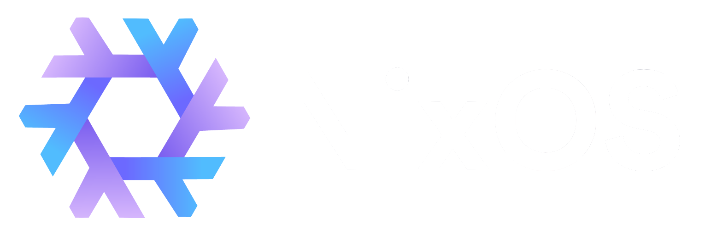

    

<h1 align="center">❄️ Re:NixOS Configurations ❄️</h1>

<a align="center" style="font-size: 8px;">𝓑𝔂 𝓡𝓮𝓢𝓽𝓻𝓪𝓷𝓰𝓮𝓻</a>

#

# Credits and thx

-  - for inspiring the configuration
-  - for config example
-  - For getting to know NixOS
